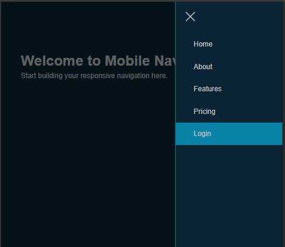

# mobile-nav-training

## Table of contents

- [Overview](#overview)
  - [The challenge](#the-challenge)
  - [Screenshot](#screenshot)
- [My process](#my-process)
  - [Built with](#built-with)
  - [What I learned](#what-i-learned)
- [Acknowledgments](#acknowledgments)


## Overview

### The challenge

A mobile navigarion that is functional and accessible. 

### Screenshot




## My process

### Built with

- Semantic HTML5 markup
- CSS custom properties
- JavaScript
- Flexbox

### What I learned

I made this challenge for myself. I felt the need to learn more about mobile navigation and accessibility. I learned during this challenge how to code a basic mobile  navigation. I watced and followed along a YouTube tutorial, but made sure that I undestand what and why I was doing. 

The area-attributes were new to me. I have heard about them before, but never used. 


```html
 aria-current="page"
```
```html
 aria-label="open sidebar" aria-expanded="false" aria-controls="navbar"
```

I also coded for the first time a "Skip to main content" button for those that use accessibility devices or moves with keyboard on web page.

```html
 <a href="#main-content" class="skip-link">Skip to main content</a>
```

An example of JavaScript function that I coded to this challenge

```js
function openSidebar() {
    navbar.classList.add('show')
    openButton.setAttribute('aria-expanded', 'true')
    navbar.setAttribute('inert', '')
}
```

## Acknowledgments

The awesome and helpfull video that I watched for this challenge: [Build Navbar Menus That Actually Work for Everyone](https://www.youtube.com/watch?v=m7YDWNz65iI)


